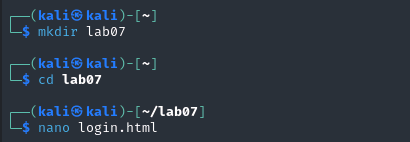
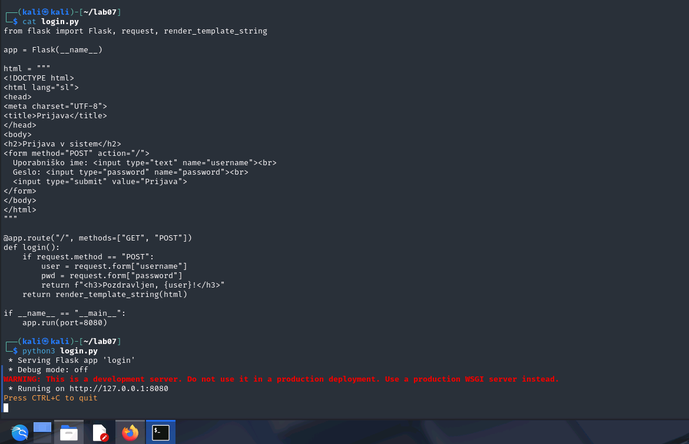
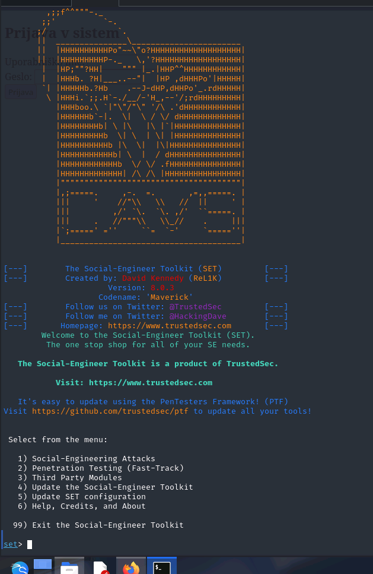
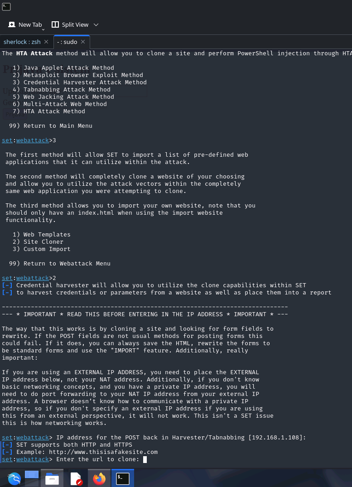
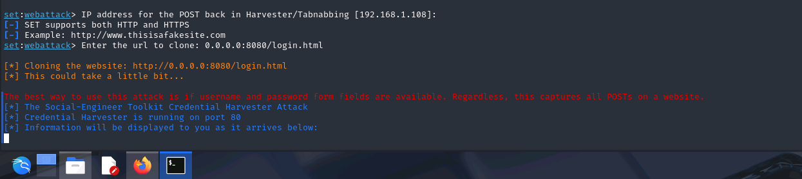
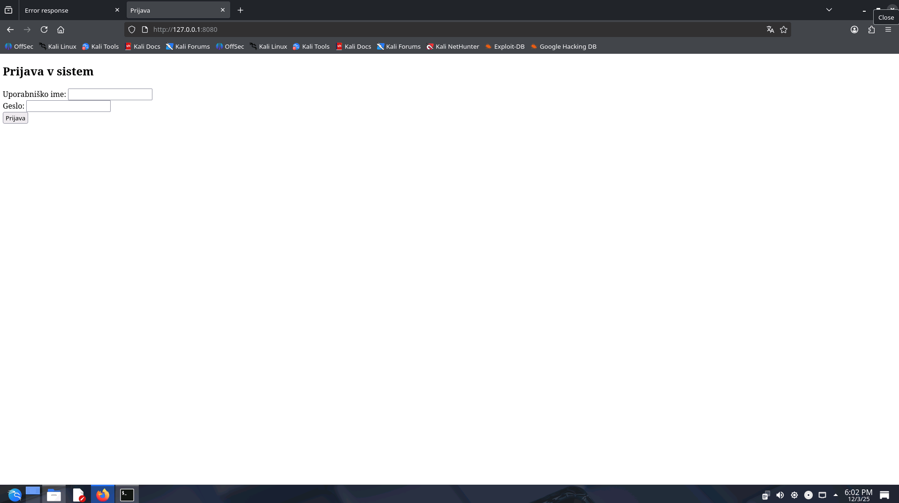
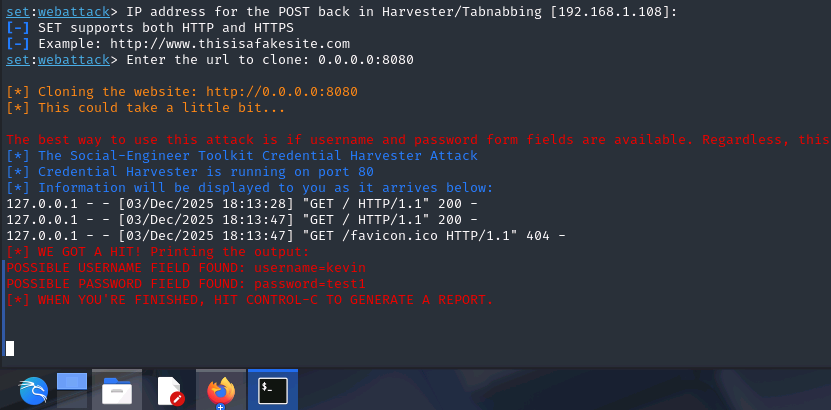

# Prepoznavanje in preprečevanje phishing napadov

📅 **Trajanje: 2 uri**

Na tej vaji boste spoznali, kako delujejo phishing napadi, kako jih prepoznati in zakaj so nevarni. Praktično boste izvedli simulacijo phishing napada z uporabo Social Engineering Toolkita (SET) in preprostega obrazca ter analizirali zajete podatke.

# 🧪 Prepoznavanje in preprečevanje phishing napadov

Phishing je ena najpogostejših tehnik socialnega inženiringa, s katero napadalci uporabnike pretentajo, da sami vnesejo svoje prijavne podatke na lažno stran. Cilj te vaje je, da se naučite, kako takšne strani izgledajo, kako delujejo in kako pomembno je prepoznati znake napada.

---

## 1️⃣ Uvod

Cilj je, da se kot uporabniki naučimo kako:  
✅ prepoznati tipične znake phishing strani  
✅ izvesti simulacijo phishing napada z uporabo SET  
✅ analizirati zajete podatke in razumeti omejitve  
✅ ozavestiti pomen preverjanja URL in varnostnih indikatorjev

---

## 2️⃣ Aktivnost

### 🖥️ Navodila

Študenti boste izvedli naslednje korake in dokumentirali rezultate:

---

#### 1️⃣ Priprava testnega obrazca
- Na svojem računalniku naredite datoteko `login.html` z naslednjo vsebino:
```html
<!DOCTYPE html>
<html lang="sl">
<head>
<meta charset="UTF-8">
<title>Prijava</title>
</head>
<body>
<h2>Prijava v sistem</h2>
<form method="POST" action="">
  Uporabniško ime: <input type="text" name="username"><br>
  Geslo: <input type="password" name="password"><br>
  <input type="submit" value="Prijava">
</form>
</body>
</html>
```

Shranjeno stran odprite v brskalniku — to je preprost prijavni obrazec, ki ga bomo uporabili kot tarčo.

---


#### 2️⃣ Zagon SET in kloniranje strani
- Zaženite SET:
```bash
sudo setoolkit
```

- Izberite menije:
  ```
  1) Social-Engineering Attacks
  2) Website Attack Vectors
  3) Credential Harvester Attack Method
  2) Site Cloner
  ```

- Ko vas vpraša za IP naslov za zajem podatkov, vpišite svoj lokalni IP naslov (npr. `192.168.x.x`) ali pustite predlaganega.



- Za URL kloniranja vpišite pot do vaše `login.html`:
  ```
  file:///home/youruser/login.html
  ```

- SET bo pripravil lažno stran in začel poslušati na portu 80.



---

#### 3️⃣ Testiranje
- Odprite brskalnik in obiščite naslov:
  ```
  http://<tvoj_IP>
  ```
- Vpišite testne podatke (npr. uporabnik: `test`, geslo: `geslo123`).

- V SET terminalu boste videli zajete podatke:
  ```
  [*] WE GOT A HIT!
  username: test
  password: geslo123
  ```

---

### 📝 Analiza in poročilo

Oddajte poročilo z naslednjimi vsebinami:
- Posnetek zaslona lažne prijavne strani



- Posnetek zaslona terminala s zajetimi podatki



- Kratek opis, kako bi žrtev prepoznala, da gre za phishing stran
  - pregled dns-a, zamenjane črke ipd., čudno naložena spletna stran...

---

## 3️⃣ Refleksija in analiza

- Katere značilnosti so značilne za phishing strani (npr. napačen URL)?
- Kako bi se zaščitili pred takšnim napadom?
  - pregled urla, ko se prijaviš, uporaba drugih načinov prijave, 2FA, MFA
- Zakaj moderne strani otežujejo takšne napade?
  - hashing se dela na frontend, drugi načini prijave (google account, github account), 2FA, MFA

---

📄 *Opomba: Vaja je namenjena izključno izobraževalnim namenom. Nikoli ne izvajajte teh tehnik na resničnih uporabnikih brez njihove vednosti in dovoljenja.*