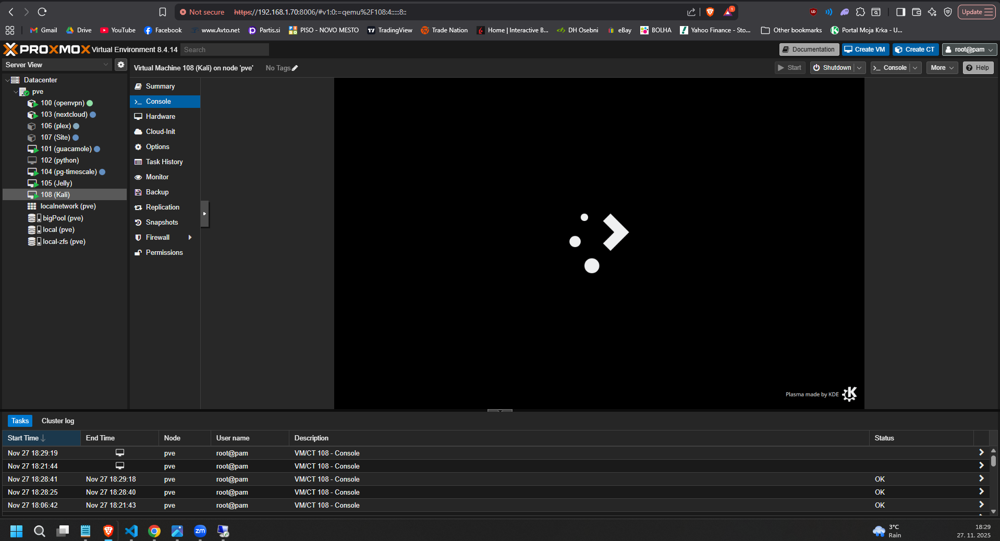
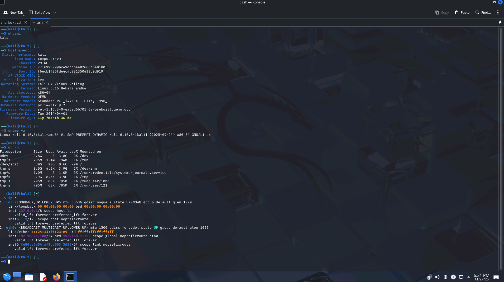
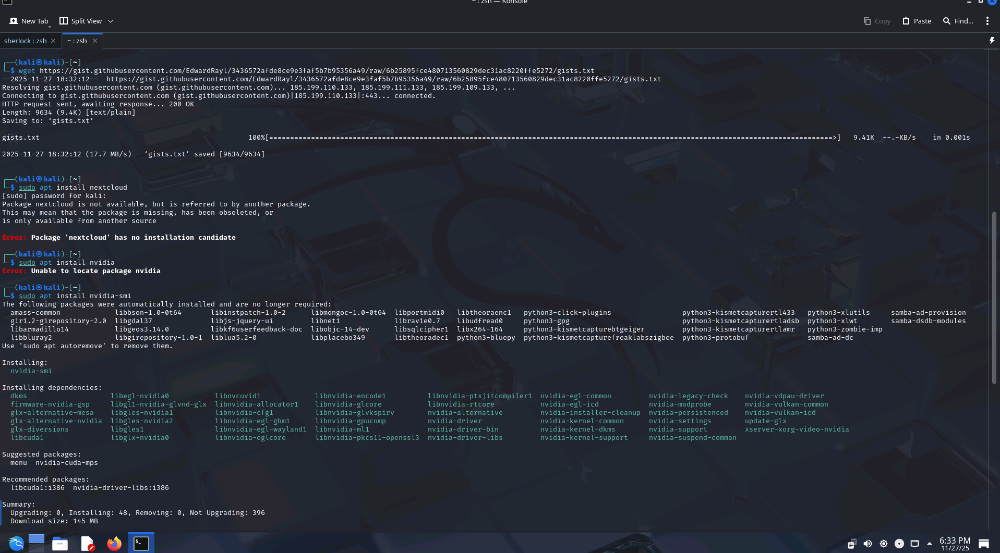
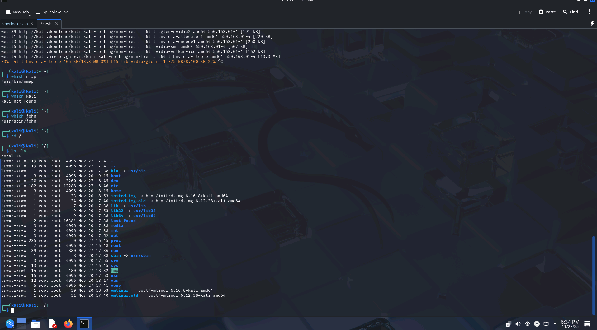
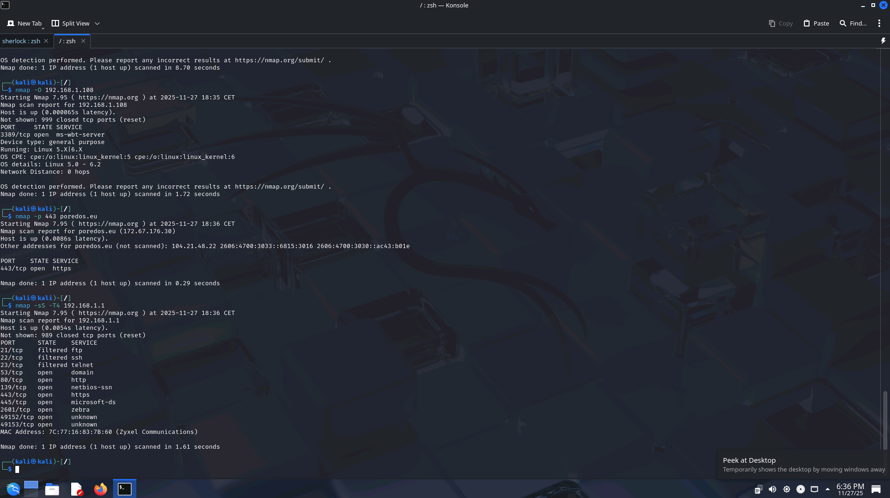
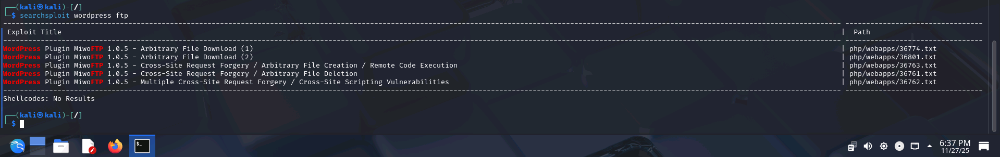
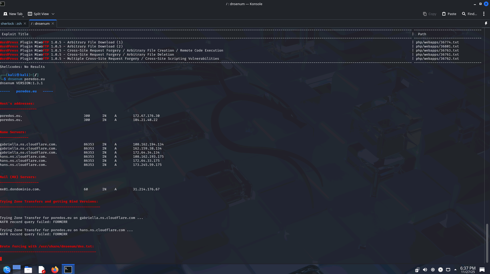
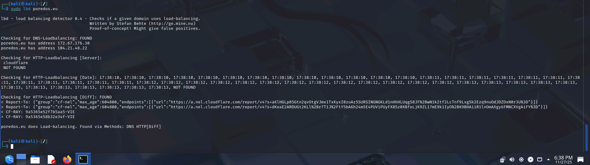
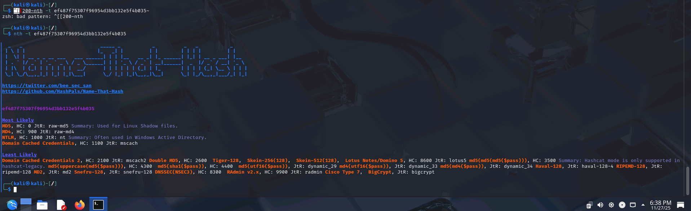

# Uvod v Kali Linux

Na tej vaji boste spoznali distribucijo **Kali Linux**, ki je standardna distribucija Linux za testiranje varnosti in etični hacking. Seznanili se boste z namenom uporabe Kali Linuxa, njegovimi glavnimi orodji in osnovnimi koncepti, ki jih mora poznati vsak varnostni strokovnjak.

# 🧪 Uvod v Kali Linux

Kali Linux je specializirana distribucija Linuxa, ki jo uporabljajo varnostni strokovnjaki za izvajanje preizkusov vdorov, analiz omrežij, forenzične analize in drugih varnostnih nalog. Vsebuje več kot 600 prednameščenih orodij.  
Poznavanje okolja Kali Linux je pomembno, saj omogoča izvajanje simulacij napadov in odkrivanje ranljivosti, še preden jih izkoristijo napadalci.

---

## 1️⃣ Uvod

Cilj vaje je, da se kot uporabniki naučimo kako:  
✅ razumeti namen in vlogo Kali Linuxa v kibernetski varnosti  
✅ se znajti v osnovnem grafičnem in ukaznem okolju Kali Linuxa  
✅ najti in zagnati nekaj ključnih orodij  
✅ izvesti osnovne ukaze in analizirati rezultate

---

## 2️⃣ Delo s Kali Linux

### 🖥️ Navodila

V nadaljevanju si bomo pogledali kako namestimo in zaženemo Kali Linux. Pogledali si bomo tudi nekaj osnovnih ukazov.

---

#### 1️⃣ Namestitev Kali Linux

Osnovne informacije o Kali Linuxu najdemo na: [https://www.kali.org](https://www.kali.org)

Navodila za namestitev Kali Linux so na voljo na naslovu: [https://www.kali.org/docs/installation/](https://www.kali.org/docs/installation/)

Slike za prenos Kali Linux najdete na: [https://www.kali.org/get-kali/#kali-platforms](https://www.kali.org/get-kali/#kali-platforms)

Priporočam uporabo znotraj virtualnega okolja VMWare ali VirtualBox. 

V sklopu Windows lahko Kali Linux namestite v okolju WSL: [https://www.kali.org/get-kali/#kali-wsl](https://www.kali.org/get-kali/#kali-wsl)

Na Mac OS X predlagam uporabo WMware Fusion [https://www.kali.org/docs/virtualization/install-vmware-silicon-host/](https://www.kali.org/docs/virtualization/install-vmware-silicon-host/)

---

- Nameščen na Proxmox privat server
- Izbran KDE-Plasma (personal preference)
- Dodan XRDP za RDP povezavo


#### 2️⃣ Zagon okolja Kali Linux

Kali Linux uporablja grafično okolje Xfce, v sklopu Linux OS so na voljo tudi druga grafična okolja: GNOME, KDE, Cinnamon, Pantheon, ...

Raziščite grafično okolje Kali Linux:
- Zaženite virtualno okolje z **Kali Linuxom**.
- Raziščite grafično okolje (meniji, sistemske informacije).
- Poiščite meni z varnostnimi orodji in preglejte 5 orodij, ki jih najdete.
- poiščite nastavitve operacijskega sistema
- razliščite datotečni sistem

---

#### 3️⃣ Osnovni ukazi v ukazni vrstici
Odprite **terminal** in izvedite naslednje ukaze ter zapišite rezultate.

| Ukaz                     | Pomen |
|--------------------------|-------|
| `whoami`                 | Prikaže prijavljenega uporabnika |
| `hostnamectl`            | Pokaže ime gostitelja in OS |
| `uname -a`               | Pokaže podatke o jedru |
| `df -h`                  | Prikaže zasedenost diska |
| `ip a`                   | Pokaže mrežne nastavitve |
| `wget url`                   | Prenos datotek iz URL naslova |
| `sudo apt install package_name`                   | Namestitev paketov s pomočjo APT |


Primer:
```bash
whoami
hostnamectl
uname -a
df -h
ip a
wget https://gist.githubusercontent.com/EdwardRayl/3436572afde8ce9e3faf5b7b95356a49/raw/6b25895fce480713560829dec31ac8220ffe5272/gists.txt
sudo apt install 7zip
which nmap
which john
cd /
ls -la
```



#### 3️⃣ Uporaba orodij v Kali Linux

V nadaljevanju si bomo pogledali in predstavili nekaj osnovnih orodij, ki so na voljo znotraj Kali Linux. 

NMAP in ZenMAP sta uporabni orodji za fazo skeniranja v Kali Linuxu. NMAP in ZenMAP sta praktično isti orodji, vendar NMAP uporablja ukazno vrstico, medtem ko ima ZenMAP grafični uporabniški vmesnik.

Nmap omogoča skeniranje po IP naslovih. Omogoča tudi prepoznavanje operacijskega sistema IP naprave z uporabo zastavice -O. 
```bash
nmap -O 192.168.1.101				# skeniranje po operacijskem sistemu
nmap -p 1-65535 -T4  192.168.1.1	# skeniranje po odprtih vratih TCP in UDP
nmap -sS -T4 192.168.1.11			# stealth-scan z uporabo SYN/ACK.
```

Searchsplit je iskalnik po zaznanih ranljivostih

```bash
searchsploit wordpress ftp 			# iskanje po zaznanih ranljivostih v Wordpress FTP razširitvah
```


Dnsenum je skripta za iskanje DNS podatkov domene in odkrivanje IP naslovov. Glavni namen Dnsenuma je zbrati čim več informacij o domeni. 

```bash
dnsenum google.com					# zagon DNS poizvedbe
```

Orodje LBD (Load Balancing Detector) omogoča zaznavo ali določena domena uporablja Load Balancer ali HTTP. 

```bash
lbd google.com						# preverjanje LB
```

Name-That-Hash je orodje, ki omogoča identifikacijo pridobljene zgoščene vrednosti niza. 

```bash
nth
sudo apt install name-that-hash		# namestitev nth
nth -t ef487f75307f96954d3bb132e5f4b035
```
⸻

## 3️⃣ Refleksija in analiza
- Zakaj uporabljamo Kali Linux? Kaj je prednost Kali Linux v primerjavi z ostalimi Linux distribucijami?
  - Je že skonfiguriran in ima nameščene programe za cyber security testiranje/pregledovanje... (Načeloma bi lahko osnovni debian pretvoriv v kali, kar kali tudi je)
- Katere funkcionalnosti in orodja Kali Linuxa so vas najbolj pritegnile?
  - nmap, traceroute, wireshark

## Reference

1. Kali Linux., *Penetration Testing Distribution*, https://www.kali.org/
2. OpenAI, (2025), *ChatGPT* (Aug 2025) [Large language model], https://chat.openai.com/
