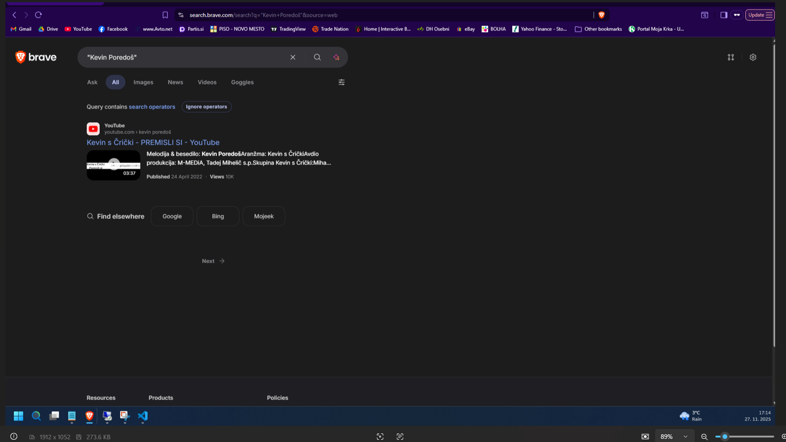
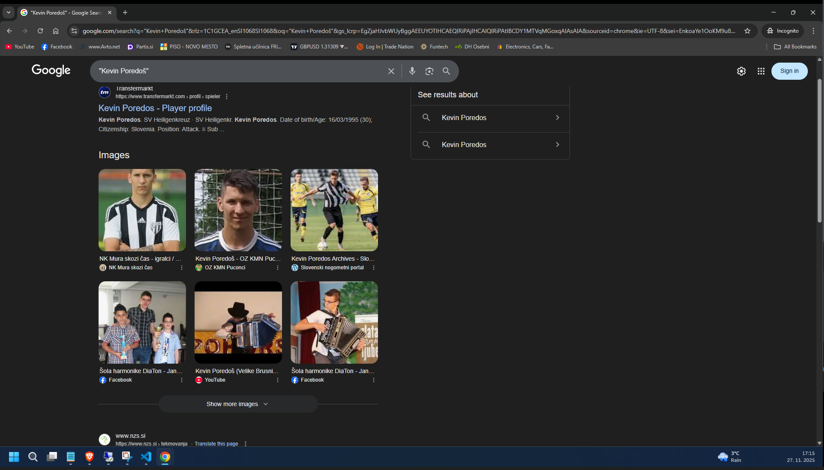
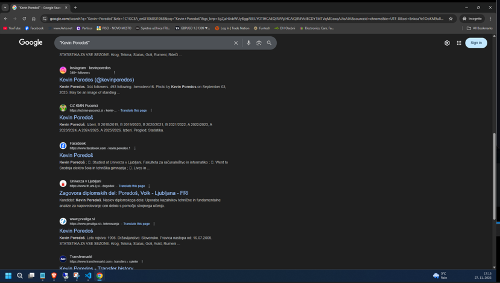
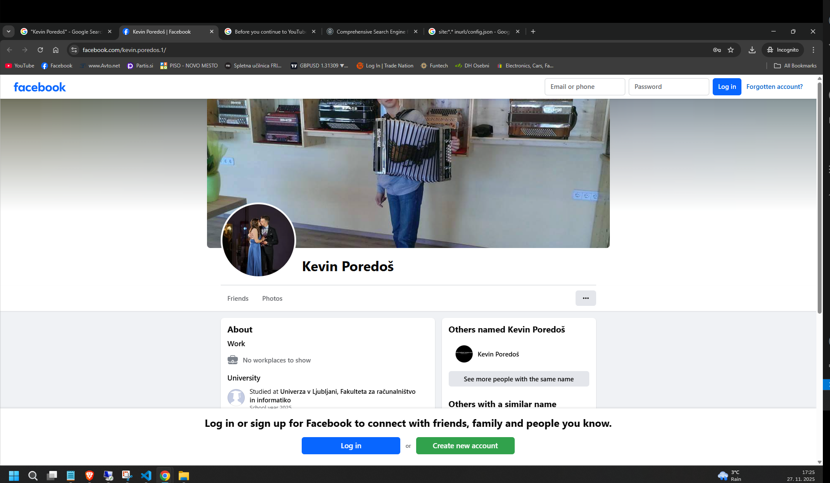
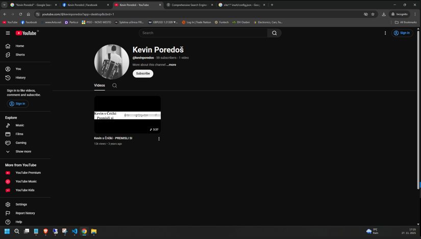
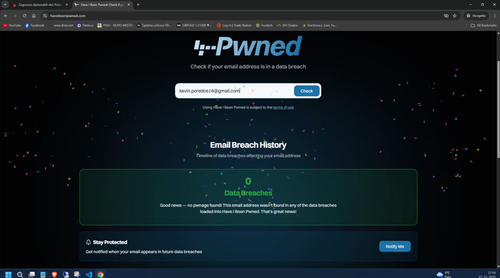

## 2️⃣ Aktivnost: Analiza osebne izpostavljenosti

V brskalniku odprite način incognito/private in poiščite informacije o sebi (npr. preko iskalnikov in storitev za preverjanje izpostavljenosti):
- Poiščite svoje ime in priimek v Googlu.
  - 
  - 
  - 
- Preverite morebitne javne profile (Facebook, LinkedIn, Instagram, forumi).
  - 
  - 
- Uporabite orodja za preverjanje izpostavljenosti (HaveIBeenPwned, OSINTLeak)
  - 
