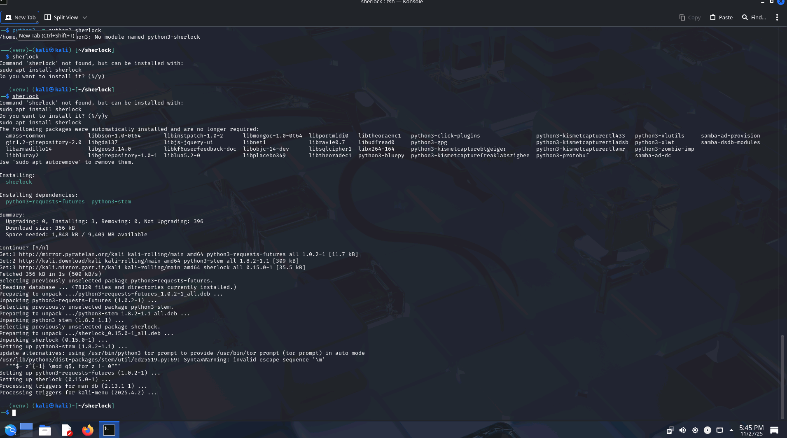
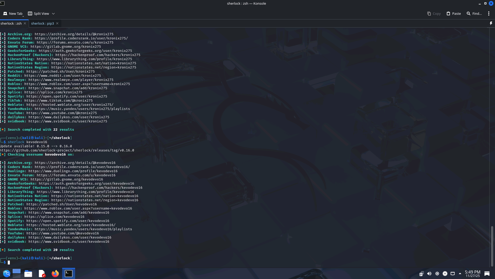
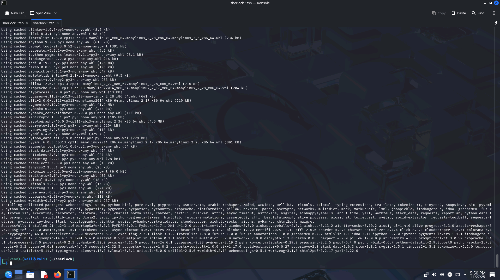
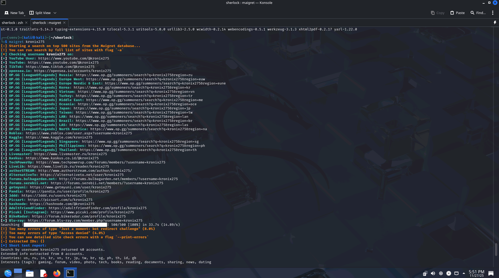
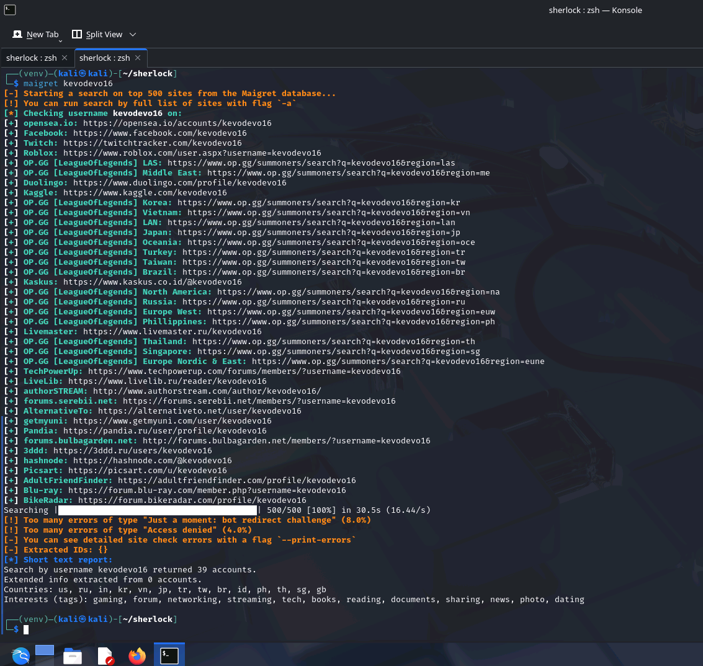
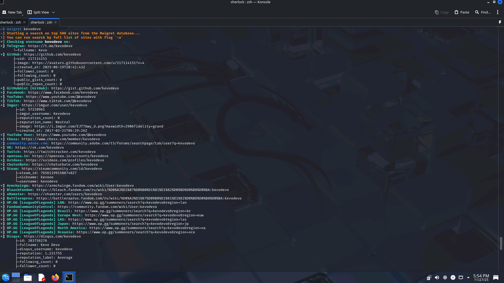
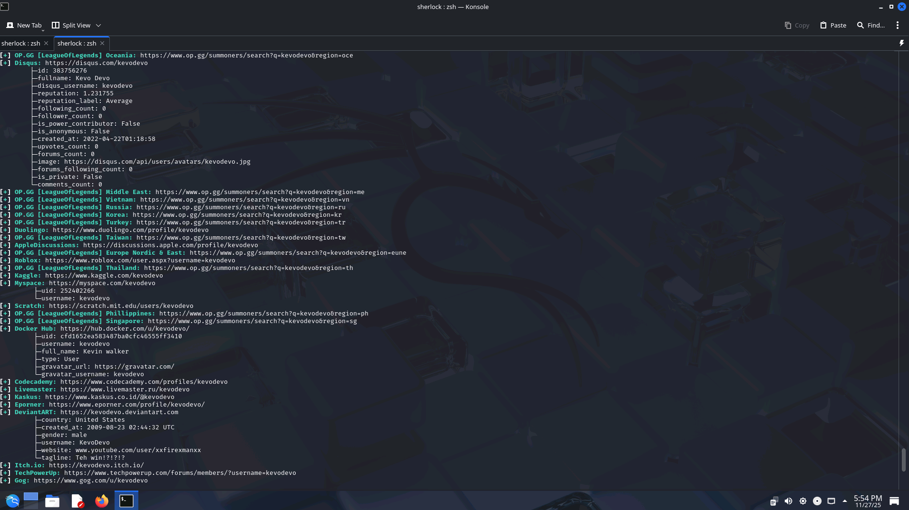
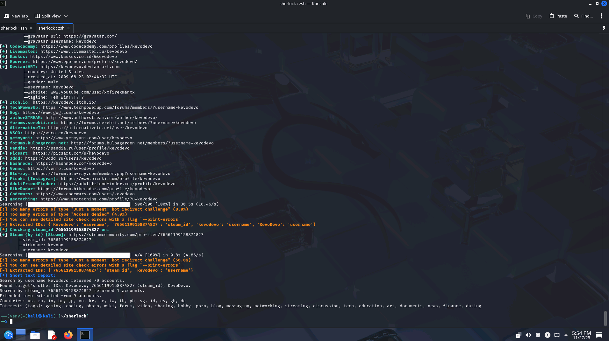

## 2️⃣ Aktivnost: OSINT - Zbiranje informacij o posamezniku

Izberite javno osebo (npr. znanega novinarja, politika, športnika) ali fiktivno osebo z vnaprej pripravljenimi podatki za vadbo (priporoča se uporaba anonimiziranih podatkov za spoštovanje zasebnosti).

### 🖥️ Sherlock

🔷 1️⃣ Priprava okolja

Sherlock je orodje, ki teče v ukazni lupini z nameščenim Pythonom.

✅ Če delate v Linux okolju (npr. Kali) je Sherlock je že pogosto nameščen ali ga namestite:

```bash
git clone https://github.com/sherlock-project/sherlock.git
cd sherlock
pip3 install -r requirements.txt
```

Zaženete Sherlock:

```bash
python3 sherlock <username>
```


### 🖥️ Maigret

🔷 2️⃣ Alternativa oz. dopolnitev Sherlocku

Maigret podobno kot SHerlock teče v ukazni lupini z nameščenim Pythonom. Podpira tudi spletni vmesnik in razne oblike izhodov in poročil.

✅ Namestitev Maigret (če še ni nameščen):
```bash
pip install maigret
```
ali iz izvorne kode:

```bash
git clone https://github.com/soxoj/maigret.git
cd maigret
pip install -r requirements.txt
```


Zagon Maigret: 

```bash
maigret <username>
```






🔷 Primerjava orodij
Uporabite oba programa za isto uporabniško ime ter rimerjajte rezultate: katero orodje je našlo več profilov? Katero je dalo bolj pregledne podatke?
- Veliko računov, ki ni mojih, že vem od prej, ker imam veliko različnih uporabniških imen zaradi ponavljanj
Razmislite: ali sta se našla profila na družbenih omrežjih, kjer tega niste pričakovali?
- adultsfriendfinder: neka X-rated stran nevem kdo je naredil

### 📝 Analiza in poročilo

- Primerjajte rezultate Sherlocka in Maigreta. Katere razlike ste opazili? 
  - Maigret več podatkov pri izpisu, tudi več rezultatov
- Ali ste našli kakšno občutljivo informacijo (npr. e‑poštni naslov, zasebne slike, telefonsko številko)? Kako bi jo lahko oseba zaščitila pred tem, da je javno dostopna?
  - Na teh profilih ne.

## 3️⃣ Refleksija in analiza

- Katere informacije so bile najlažje najdene? Katere je bilo najtežje najti?
- Kako bi vi sami prilagodili svoje vedenje na spletu, potem ko ste izvedli to vajo?
  - Že zdaj mirkam, mogoče bi preveril račune iz otroštva kaj je gor (LOL, Roblox...)
- Ali menite, da je uporaba OSINT orodij etično sporna? V katerih primerih je upravičena?
  - Čisto odvisno od uprabe. Za phishing, identity theft definitivno sporno, za odkrivanje podaktov v kakšnih težkih kriminalnih primerih pa uporabno