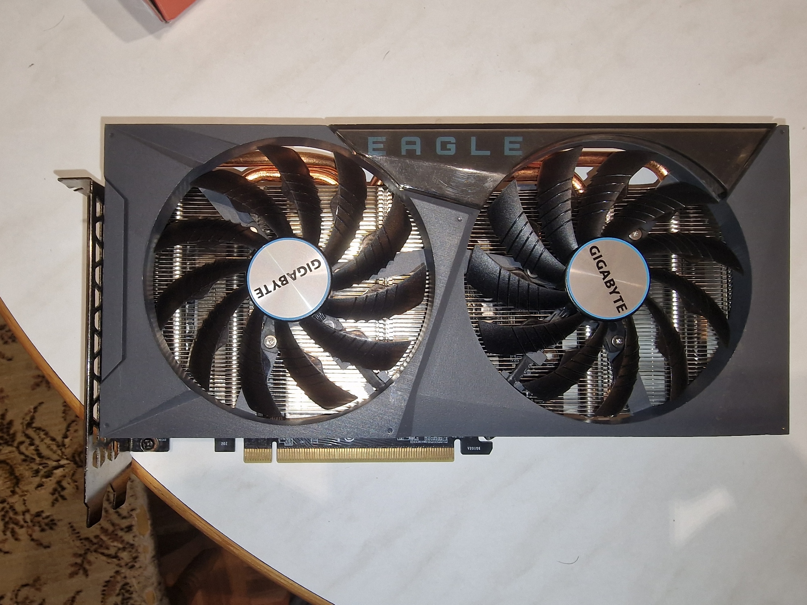
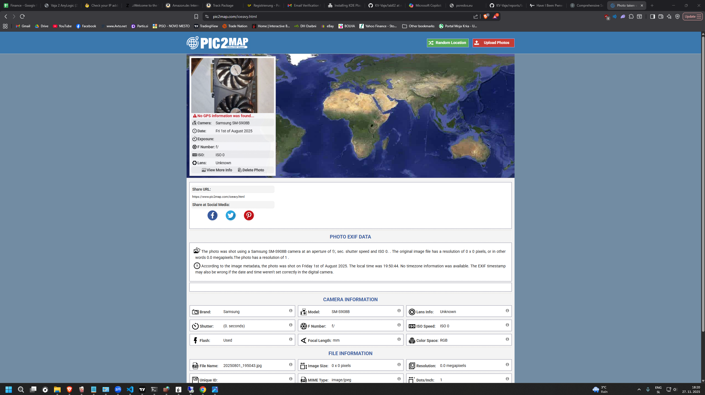
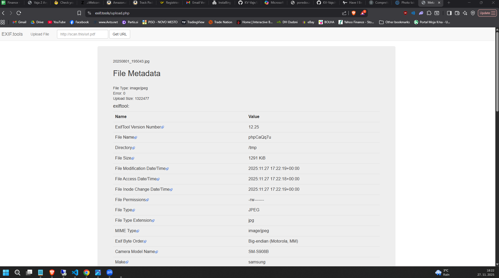
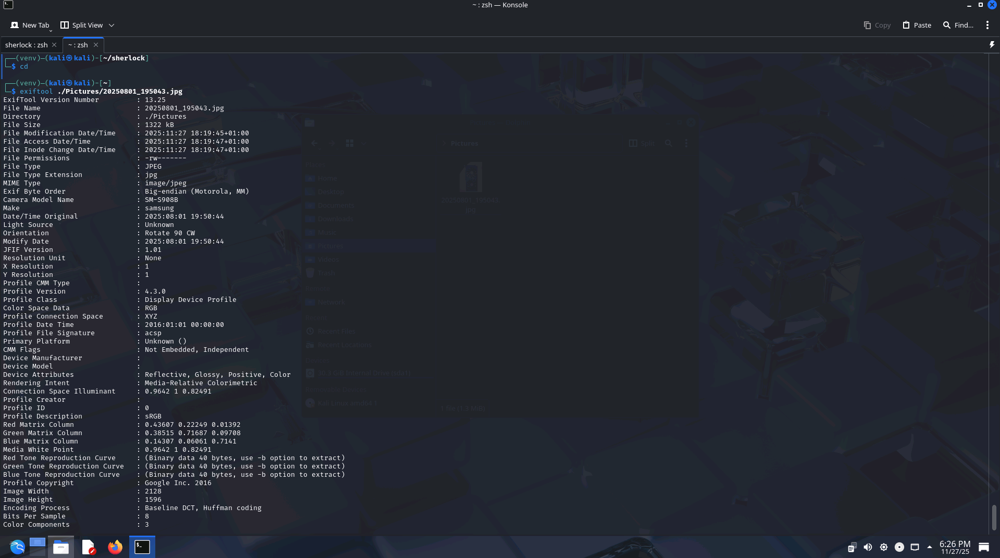
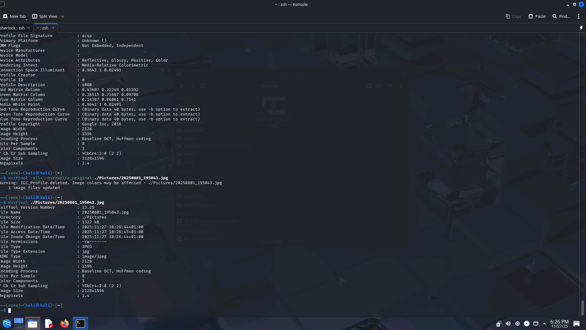

# MetaOSINT – Kaj vse razkrije fotografija?

EXIT (angl. Exchangeable Image File Format) je standard za shranjevanje metapodatkov v slikovnih, zvočnih in drugih večpredstavnostnih datotekah. Velikokorat naprave kot so digitalni fotoaparati in mobilni telefoni shranjujejo tovrstne informacije v fotografije.

Ta vaja je namenjena raziskovanju informacij, ki jih lahko razkrijemo s pomočjo **metapodatkov v fotografijah (EXIF)**. S pomočjo različnih orodij bomo analizirali fotografije in ugotavljali informacije, ki jih lahko s pomočjo MetOSINT razkrijemo, kot so lokacija in čas nastanka fotografije, naprava in druge skrite podatke.

## 1️⃣ Uvod: Zbiranje informacij o fotografijah

Cilji vaje so:  
✅ Razumeti pomen metapodatkov v digitalnih fotografijah.  
✅ Uporabiti OSINT orodja za analizo EXIF podatkov.  
✅ Oceniti tveganja, povezana z deljenjem slik na spletu.  
✅ Razviti kritično razmišljanje o zasebnosti in digitalnih sledeh.

---

### MetaOSINT

MetaOSINT je tehnika v okviru OSINT (Open Source INTelligence), kjer analiziramo metapodatke datotek, predvsem fotografij z namenom pridobivanja informacij o izvoru, napravi, avtorju ali času nastanka.

V kolikor fotografija vsebuje metapodatke lahko iz njih pridobimo npr. GPS podatke in določimo točno lokacijo nastanka fotografije. Metapodatki tudi razkrijejo, ali je bila slika naknadno urejena. Iz metapodatko pa lahko pridobimo tudi podatke o avtorju in napravi.

---

### 🔍 Orodja za analizo EXIF metapodatkov

Obstaja veliko orodij za analizo metapodatkov. 

Najbolj pogosto uporabljeno orodje je exiftool (https://exiftool.org/)

[Dokumentacija in GitHub](https://github.com/exiftool/exiftool)

Obstaja pa tudi veliko spletnih orodij: 
-  [https://www.pic2map.com/](https://www.pic2map.com/)
- [https://exif.tools/](https://exif.tools/)
- [Online Exif Viewer](https://onlineexifviewer.com/)  

---

## 🖼️ Uporaba MetaOSINT na fotografijah

Uporabili bomo testno sliko z vključenimi EXIF podatki, fotografijo bomo vzeli iz zbirke exif-samples, lahko pa tudi uporabite vašo lastno fotografijo, npr iz mobilnega telefona

Najprej torej izberemo fotograifijo:
- [https://github.com/ianare/exif-samples](https://github.com/ianare/exif-samples)
- Ali pa sliko z lastnim mobilnim telefonom (poskrbite, da ima vključeno lokacijo).

---


## 📝 Navodila za izvedbo

1. **Izberite fotografijo z EXIF podatki**
   - Zaželjeno je, da je to fotografija, ki je bila posneta z mobilno napravo z omogočeno lokacijo.
   - 

2. **Naložite fotografijo v spletno orodje**
   - Odprite [https://pic2map.com](https://pic2map.com) ali [https://exif.tools](https://exif.tools)
   - Naložite svojo testno sliko.
   - Oglejte si rezultate analize: GPS, datum, čas, naprava, orientacija itd.
   - 
   - 

3. **Analizirajte lokacijo**
   - Če so prikazane koordinate, jih prilepite v Google Maps ali OpenStreetMap in preverite dejansko lokacijo.
   - Primerjajte ali se lokacija ujema z realnostjo.
   - Ni koordinat

4. **Analizirajte čas in napravo**
   - Kdaj je bila slika posneta?
     - 1.8.2025
   - S katero napravo?
     - Samsung SM-S908B (S22 Ultra)
   - So prisotni drugi zanimivi podatki (npr. orientacija, programska oprema itd.)?
     - Uporabljen Flash, 90W orientirano

---

## 📝 Analiza in poročilo

Odgovorite na naslednja vprašanja:

1. Kakšna je bila natančna lokacija (koordinate in naslov)?
   - ni je
2. Kdaj je bila slika posneta?
   - 1.8.2025 
3. Katere druge metapodatke si zaznal?
   - Uporabljen Flash, 90W orientirano, tip telefona
4. Kaj vas je presenetilo?
   - Uporabljen Flash, 90W orientirano
5. Kaj bi priporočali osebi, ki redno objavlja slike na spletu?
   - Zbrisati metapodatke

---

## 💬 Refleksija

- Ali bi moral vsak pred objavo slike odstraniti EXIF podatke?
  - ne nujno
- Kako se lahko zaščitimo pred zlorabo takšnih informacij?
  - Zbrišemo take informacije
- Ali si že kdaj objavil sliko, ki je vsebovala takšne metapodatke? Kakšen bi bil tvoj odziv danes?
  - Ja, IG, ne vem ne zdi se mi tako zelo sporno

---

## 🛠️ Dodatno

- Poskusite uporabiti orodje `exiftool` lokalno v terminalu:
```bash
exiftool slika.jpg
```

---

## 📌 Pomembno

Namen vaje ni kršiti zasebnosti drugih, temveč **ozavestiti, kako hitro in preprosto je razkriti podatke iz slike** ter se posledično **naučiti varne rabe digitalnih vsebin**.

---

## 🧼 Kako odstraniti EXIF metapodatke

Če želimo pred objavo slike odstraniti vse metapodatke, imamo več možnosti:

### 🖥️ Z uporabo `exiftool` (ukazna vrstica)

1. Namestite orodje:
```bash
sudo apt install libimage-exiftool-perl   # Debian/Ubuntu
brew install exiftool                     # macOS
```

2. Za odstranitev vseh metapodatkov iz slike (ustvarite kopijo):
```bash
exiftool -all= slika.jpg
```

3. Če želite prepisati obstoječo datoteko:
```bash
exiftool -all= -overwrite_original slika.jpg
```

---

### 🌐 Spletna orodja (za testne primere)

- [https://www.verexif.com/en/](https://www.verexif.com/en/)
- [https://www.exifremove.com/](https://www.exifremove.com/)

⚠️ Opozorilo: Ne uporabljajte spletnih orodij za občutljive slike.

---

### 🪟 Windows

- Desni klik na sliko → **Properties** → **Details**
- Klik **Remove Properties and Personal Information**

---

### 📱 Mobilni telefoni

**Android**:
- Photo Exif Editor
- Scrambled Exif (F-Droid)

**iOS**:
- Metapho
- Exif Metadata


## Reference


1. Pic2Map, *Photo location viewer*, https://www.pic2map.com/
2. Exif.tools, *Online EXIF data viewer*. https://exif.tools/
3. Online Exif Viewer, *View EXIF data online*. https://onlineexifviewer.com/
4. Verexif, *Remove EXIF metadata online*. https://www.verexif.com/en/
5. Exif Remove, *Remove EXIF metadata from photos*. https://www.exifremove.com/
6. OpenAI. (2025), *ChatGPT* (Aug 2025) [Large language model], https://chat.openai.com/