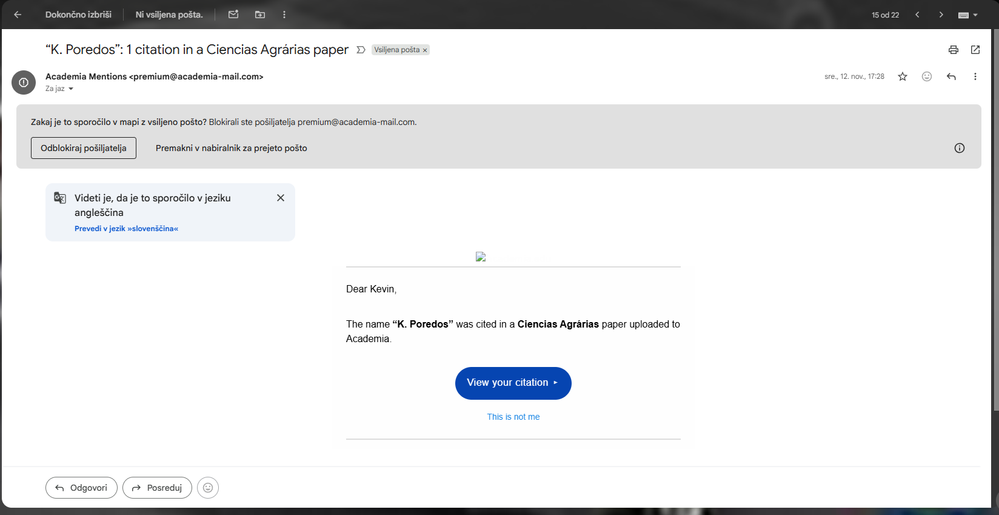
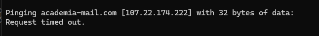
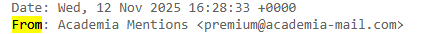
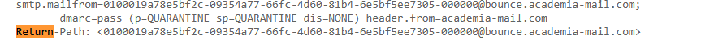

# Socialni inženiring in obrambe pred njim

Socialni inženiring izkorišča človeško psihologijo, ne tehnične ranljivosti.
Napadalci ciljajo na čustva, navade in nepozornost posameznikov, da pridobijo dostop do informacij ali sistemov brez uporabe zapletenih tehnik vdiranja.

# 🧪 Spoznajmo kibernetski prostor

Pri prvi vaji smo spoznali, koliko informacij posamezniki delijo v kibernetskem prostoru — zdaj poglejmo, kako se te informacije lahko zlorabijo.

Seznanili se bomo z najpogostejšimi metodami socialnega inženiringa, kot so phishing, vishing, pretexting in baiting, ter s tem, kako jih prepoznati in se proti njim učinkovito zaščititi.

Okoli 90% napadov na posameznike se zgodi prav zaradi slabe osveščenosti in izkoriščanja socialnega inženiringa — ta vaja gradi most med teorijo in vsakdanjo prakso, ki jo bomo potrebovali tako v zasebnem kot poklicnem življenju.

Druga vaja je spoznavanju socialnega inženiring:

- Kaj je socialni inženiring?
- Kakšne so tehnike socialnega inženiring in kako ga zaznavamo?
- Kako se lahko pred socialnim inženiring zavarujemo?

## 1️⃣ Uvod: Tehnike socialnega inženiringa

Cilji vaje:  
✅ Prepoznati glavne tehnike socialnega inženiringa.  
✅ Preveriti lastno pripravljenost na tovrstne napade.  
✅ Spoznati konkretne strategije obrambe in dobre prakse.  

### Prepoznavanje tehnik socialnega inženiringa

📧 Phishing

Najpogostejša oblika napada: napadalec pošlje e‑sporočilo v katerem se pretvarja, da prihaja od zaupanja vredne organizacije ter tako uporabnika prepriča, naj klikne na povezavo ali posreduje določene podatke.

Primer:

»Vaš račun bo deaktiviran, če ne posodobite podatkov. Kliknite tukaj za prijavo.«

🛑 Na kaj biti pozoren: napačni e‑naslovi, slovnične napake, sumljivi URL‑ji.

🎯 Spear Phishing

Ciljni napad na posameznika, pogosto prilagojen njegovim podatkom (npr. delovno mesto ali pretekla komunikacija).

Primer:

»Pozdravljeni, Janez. Kot sva se dogovorila prejšnji teden, pošiljam vam dokumente. Odprite priponko.«

☎️ Vishing (Voice Phishing)

Napadalec pokliče žrtev in se predstavi kot uradna oseba (npr. tehnična podpora, banka) ter zahteva podatke.

Primer:

»Tukaj iz banke. Potrebujemo vašo PIN kodo, da odblokiramo vaš račun.«

📝 Pretexting

Napadalec si izmisli zgodbo (pretext), da bi pridobil podatke ali dostop. Ta tehnika temelji na vzpostavitvi zaupanja.

Primer:

»Sem novi uslužbenec v IT‑podpori. Potrebujem vaš uporabniški račun za preverjanje nastavitve sistema.«

🎁 Baiting

Napadalec ponudi mamljivo “vabo”, da bi žrtev sama namestila zlonamerno programsko opremo.

Primer:

USB ključek z napisom »Zaupno« ali »Plačilni podatki«, puščen na parkirišču podjetja.

🎯 Kako jih prepoznati?

✅ Vedno preverimo identiteto pošiljatelja/klicalca.  
✅ Ne klikamo na sumljive povezave ali odpirajte neznanih priponk.  
✅ Ne delimo osebnih ali prijavnih podatkov po telefonu ali e‑pošti.  
✅ Če se zgodba zdi sumljiva ali preveč nujna — preverimo pri uradnem viru.  

## 2️⃣ Aktivnost: Analiza phising primerov

### E-poštno sporočilo za prevzem paketa
```bash
From: dostava@postapaket.xyz
Subject: Vaš paket čaka na dostavo!

Spoštovani,

obveščamo vas, da vaš paket čaka na dostavo. Za prevzem morate potrditi svoje podatke v naslednjih 24 urah, sicer bo paket vrnjen pošiljatelju.

Kliknite tukaj: http://posta-dostava-verify.paket-secure.ru

Za pomoč se obrnite na našo podporo.

Hvala,
Ekipa Pošte
```
### E-poštno sporočilo glede deaktivacije računa
```bash
From: varnost@bankaa-si.com
Subject: Vaš račun bo deaktiviran!

Spoštovani uporabnik,

zabeležili smo sumljive aktivnosti na vašem bančnem računu. Če v naslednjih 12 urah ne potrdite svojih podatkov, bomo primorani vaš račun deaktivirati.

Kliknite tukaj za potrditev: http://bankaa-si-login.net

Hvala za sodelovanje.

Varnostna služba banke
```
### E-poštno sporočilo glede nagrade

```bash
From: nagrade@promocije.win
Subject: Čestitamo! Osvojili ste nagrado!

Spoštovani!

Izžrebani ste bili kot dobitnik glavne nagrade v naši promociji! Za prevzem nagrade prosimo, da vnesete svoje podatke in plačate simbolično pristojbino za dostavo.

Kliknite tukaj: http://promo-claim-now.biz

Veselimo se vaše udeležbe!

Promocijska ekipa
```
## 3️⃣ Preverjanje phishing sporočil

Vsako e‑sporočilo ima glavo sporočila (header), ki vsebuje tehnične podatke o pošiljatelju, naslovniku, času, IP‑jih in strežnikih. Header je pomemben za preiskovanje sumljivih sporočil. 

Primer sumljivih znakov:
- Različni “From” in “Return‑Path”
- IP‑ji iz čudnih držav
- Neujemajoča domena pošiljatelja
- SPF/DKIM/DMARC napake

V svojem e-poštnem predalu poiščite mapo SPAM in najdite sumljivo sporočilo, lahko preverite tudi kakšno sporočilo v INBOX v kolikor za katerega sumite, da bi lahko predstavljalo sumljivo sporočilo. 

Preverite in zapišite:
- Kakšen je dejanski IP pošiljatelja?
  - 
  - 
- Ali se domena pošiljatelja ujema z naslovom v “From”?
  - 
  - 
- Iz katere države približno izvira sporočilo?
- So v headerju vidni znaki preusmeritev preko več strežnikov?
- So prisotne napake SPF/DKIM/DMARC?


## 4️⃣ Ustvarite lastno phishing sporočilo (v izobraževalne namene)

Pripravijte primer lastnega phishing napada (besedilo e-maila ali SMS sporočila), z določenim ciljem (npr. kraja gesla, napeljava na prenos datoteke, …).

Izberite kateri tip napada boste uporabili (phishing, vishing, pretexting…)
Določite čustveni in psihološke vzvode za dosego cilja in zapišite kako bi izgledal “realističen” email z vizualnimi elementi (npr. logotipi, stil, slovnične napake)


## 4️⃣ Refleksija in analiza

- Kako hitro opazite sumljivost e-poštnega sporočila?
- Bi z zagotovostjo lahko vsako sporočilo prepoznali kot nevarno brez headerja?
- Kaj bi svetovali nekomu, ki je nov uporabnik elektronske pošte glede nevarnosti, ki nanj prežijo iz vidika socialnega inženiringa?