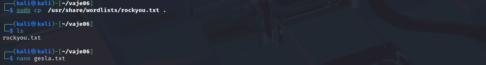
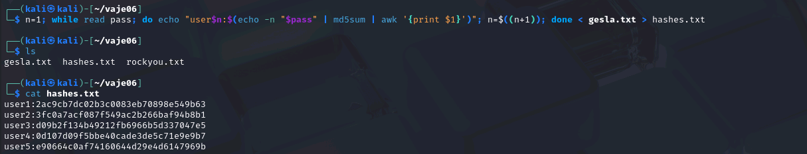
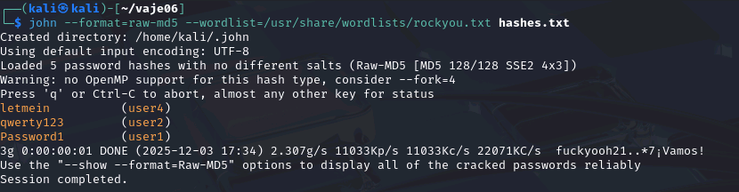
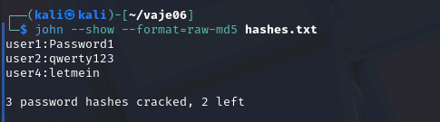

# Testiranje varnosti gesel z razbijanjem zgoščenih vrednosti

Gesla so še vedno najpogosteje uporabljeno sredstvo za avtentikacijo, a pogosto so šibka ali ponovno uporabljena. V tej vaji bomo spoznali, kako deluje napad z uporabo slovarjev na slabo izbrana gesla. Namen vaje je pokazati, zakaj je pomembno uporabljati kompleksna in dolga gesla.


# 🧪 Testiranje varnosti gesel z razbijanjem zgoščenih vrednosti

Z gesli posamezniki in organizacije varujejo dostop do sistemov, podatkov in storitev.

Kljub temu pa mnogi še vedno uporabljajo kratka, enostavna ali ponovno uporabljena gesla, kar napadalcem omogoča hitro ugibanje ali iskanje ujemanj v predpripravljenih seznamih. Raziskave kažejo, da so med najpogostejšimi gesli še vedno »123456«, »password« in podobne kombinacije, ki jih napadalci uganejo v nekaj sekundah.

Da bi shranjevanje gesel na strežnikih bilo varnejše, se namesto dejanskih (čistopisnih) gesel shranjujejo njihove zgoščene vrednosti. Zgoščevanje (hashing) je enosmerni matematični proces, pri katerem iz gesla izračunamo krajši niz znakov, imenovan hash, iz katerega (v teoriji) izvirnega gesla ni mogoče obnoviti. Čeprav zgoščevanje preprečuje neposredno krajo gesel v primeru vdora v bazo podatkov, pa ne pr


## 1️⃣ Uvod: Upravljanje osebnih identitet

Cilj je, da se kot uporabniki naučimo kako:  
✅ razumeti, kako deluje zgoščevanje (hashing) gesel  
✅ videti razliko med šibkimi in močnimi gesel  
✅ praktično uporabiti orodja za »cracking« gesel  
✅ ozavestiti pomen varnih gesel in zakaj ne uporabljamo slabih  

### Varnost zgoščenih vrednosti

Zgoščevanje (hashing) je enosmerni matematični postopek, ki iz poljubno dolgega niza podatkov izračuna fiksno dolgo »prstno odtisno« vrednost (hash). V informacijskih sistemih se uporablja predvsem za shranjevanje preverjanj gesel, saj strežnik ne shranjuje dejanskih gesel, temveč njihove zgoščene vrednosti. Ko uporabnik vnese geslo, sistem izračuna njegov hash in ga primerja s shranjenim.

Čeprav je zgoščevanje pomemben varnostni mehanizem, pa samo po sebi ne preprečuje napadov. Napadalci lahko s slovarskimi ali brutalnimi napadi ugibajo gesla in izračunavajo njihove hash-e, dokler ne najdejo ujemanja. Zato so ključni dodatni ukrepi, kot so uporaba dolgih in kompleksnih gesel, uporaba »soli« (salt), ki prepreči uporabo vnaprej pripravljenih tabel (rainbow tables), ter počasnejši algoritmi (npr. bcrypt, scrypt ali Argon2), ki otežijo množično računanje hash-ov.

Pomembno je torej razumeti, da varnost gesla ne zagotavlja le zgoščevanje, ampak kombinacija varnostnih praks: močna gesla, dodajanje soli in uporaba primernih algoritmov.


## 2️⃣ Aktivnost: Uporaba John The Ripper za razbijanje zgoščenih vrednosti

### 🖥️ John The Rippper

#### Navodila za namestitev

1️⃣ Namestite John the Ripper (če še ni nameščen):


```bash
sudo apt update
sudo apt install john
```

2️⃣ Preverite, ali imate wordlist:

```bash
ls /usr/share/wordlists/rockyou.txt
```

Če ga ni, ga prenesite:
```bash
wget https://github.com/brannondorsey/naive-hashcat/releases/download/data/rockyou.txt
```

🔐 Priprava podatkov

1️⃣ Ustvarite datoteko gesla.txt z nekaj primeri:
```bash
Password1
qwerty123
My$Strong&Pass2024
letmein
Summer2024
```

2️⃣ Pretvorite gesla v zgoščene vrednosti z ukazom openssl:

```bash
n=1; while read pass; do echo "user$n:$(echo -n "$pass" | md5sum | awk '{print $1}')"; n=$((n+1)); done < gesla.txt > hashes.txt
```

Datoteka hashes.txt bo vsebovala MD5 hashe:

```bash
2ac9cb7dc02b3c0083eb70898e549b63
3fc0a7acf087f549ac2b266baf94b8b1
d09b2f134b49212fb6966b5d337047e5
0d107d09f5bbe40cade3de5c71e9e9b7
e90664c0af74160644d29e4d6147969b
```

🚀 Izvedba napada

1️⃣ Zaženite napad z uporabo wordlista:
```bash
john --format=raw-md5 --wordlist=/usr/share/wordlists/rockyou.txt hashes.txt
```

2️⃣ Prikaz najdenih gesel:

```bash
john --show hashes.txt
```


### 📝 Analiza in poročilo

- Zabeležite, katera gesla so bila najdena in kako hitro.
  - 
  - manj kot 5 sekund
- Katerega močnega gesla program ni našel? Zakaj?
  - Summer2024, My$Strong&Pass2024, ker jih ni v rockyou.txt datoteki

## 3️⃣ Refleksija in analiza

- Kako se povečuje ocena varnosti, ko dodajate dolžino?
  - Dalj časa traja dekripcija
- Kako vplivajo posebni znaki na oceno?
  - Več znakov = dalj časa za dekripcijo (abeceda 25 znakov, ascii 128 in se eksponentno veča)
- Kako se ocenjuje “passphrase” v primerjavi s klasičnim geslom?
- Katero geslo bi priporočili za vsakodnevno uporabo in zakaj?
  - (Kakšno): Dolgo vsaj 12 mest, Velike male črke, najmanj 1 številka in 1 posebni znak (.,!)
  - Dolgo trajanje dekriptiranja


## Reference


1. John the Ripper, *John the Ripper password cracker
*, https://www.openwall.com/john/
2. John the Ripper, GitHub, https://github.com/openwall/john
3. Rockyou.txt wordlist, https://github.com/brannondorsey/naive-hashcat/releases/download/data/rockyou.txt
4. OpenAI. (2025), *ChatGPT* (Aug 2025) [Large language model], https://chat.openai.com/